# ⚾ 야구 볼래

> AI와 함께 배우고 응원하는 KBO 입문 도우미 서비스

<p align="center">
  
</p>

<p align="center">
  
</p>

---

# 📖 About The Project

## 야구 볼래란?

야구는 규칙, 용어, 응원 문화, 구단 정보 등 다양한 진입 장벽이 존재합니다.

야구 볼래는 AI 캐릭터 기반의 야구 입문 도우미 서비스로, 사용자가 쉽고 재미있게 야구를 배우고 응원할 수 있도록 지원합니다.

### 🎯 Problem

- 야구 규칙과 용어가 어렵다.
- 응원할 구단을 선택하기 어렵다.
- 직관 정보를 찾기 어렵다.
- 팬들과 소통할 공간이 부족하다.

### 💡 Solution

- AI 야구 설명 챗봇 제공
- 구단별 팀 채팅방 제공
- 직관 및 경기 기록 기능 제공
- 구장 정보 통합 제공

---

# ✨ Features

| 🤖 AI 야구 도우미 | 💬 팀 채팅방 | 📅 나만의 기록 |
|---|---|---|
| 야구 규칙 설명<br>야구 용어 설명<br>경기 상황 해설<br>초보자 맞춤 답변 | 구단별 채팅방<br>실시간 응원<br>팬 커뮤니티 | 연속 기록 도전<br>직관 기록 캘린더<br>경기 기록 조회 |

| 🧑 야구짝꿍 | 🏟️ 구장정보 | ⚙️ 환경설정 |
|---|---|---|
| 성별 설정<br>닉네임 설정<br>출석 체크<br>꾸미기<br>응원하기<br>퀴즈 풀기 | 구장 안내<br>먹거리 정보<br>지역 정보<br>교통 정보 | 내 정보 관리<br>응원구단 변경<br>알림 설정 |

---

# 🎬 Demo

| VIEW | 1 | 2 | 3 |
|---|---|---|---|
| 로그인 및 시작하기 | 회원가입 | 로그인 | 응원구단 선택 |
|  | 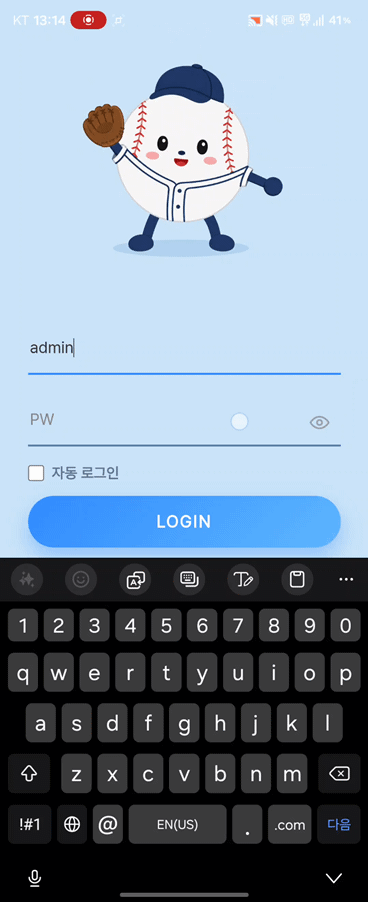 | 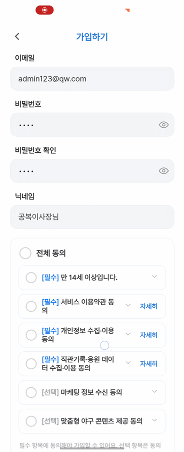</img> | 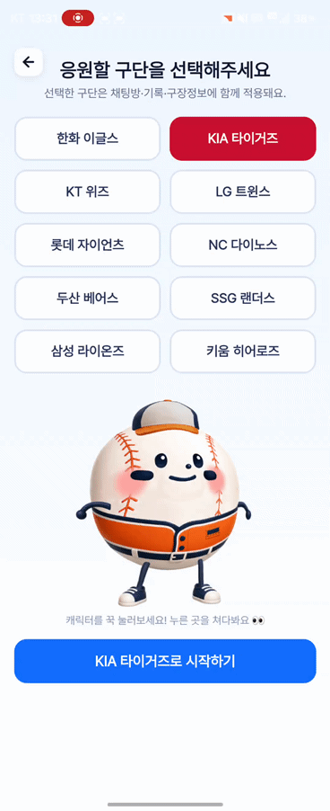</img> |
| 메인 서비스 | 홈 화면 | AI 도우미 | - |
|  | 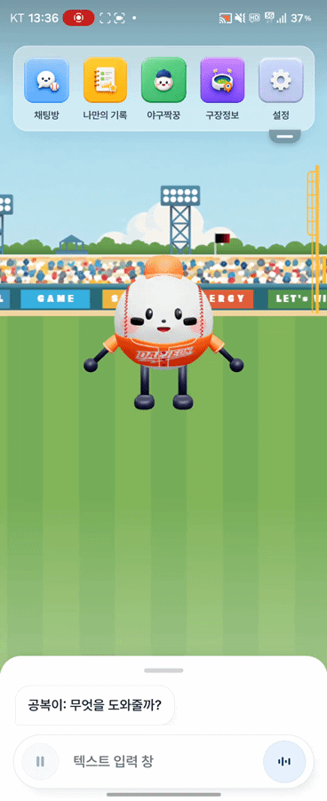 | 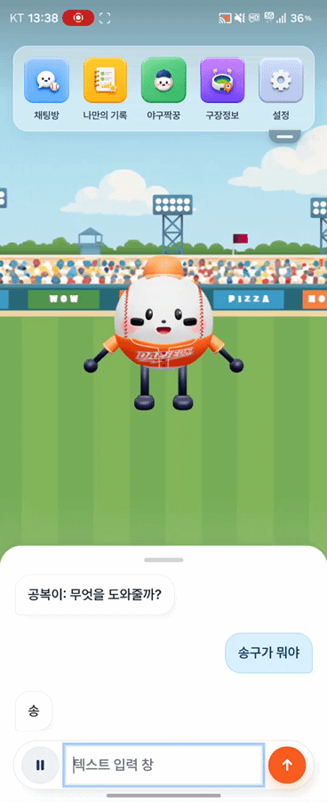 | - |
| 채팅방 | 채팅방 메인 | - | - |
|  | 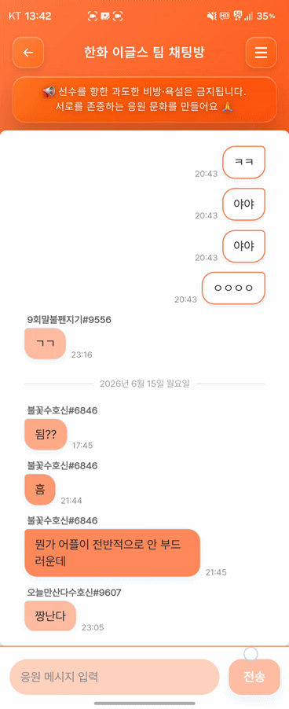 | - | - |
| 나만의 기록 | 연속 기록 도전 | 직관 기록 캘린더 | 경기 기록 조회 |
|  | 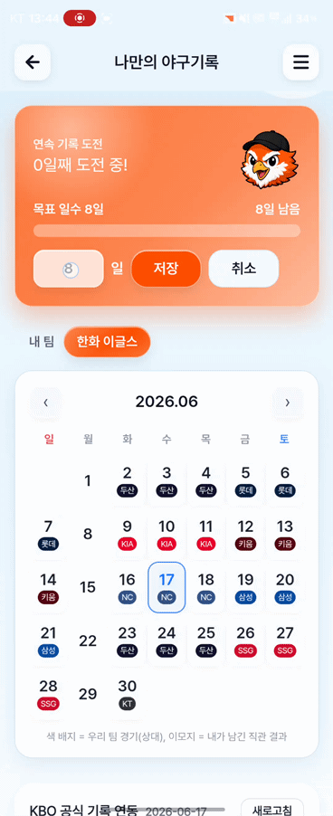 | 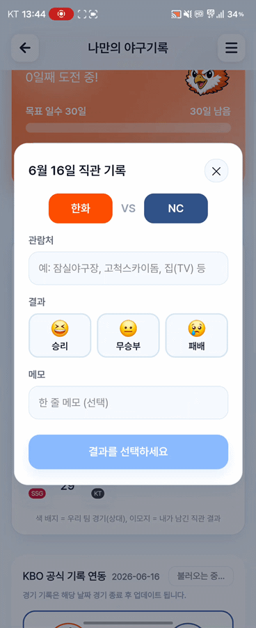 | 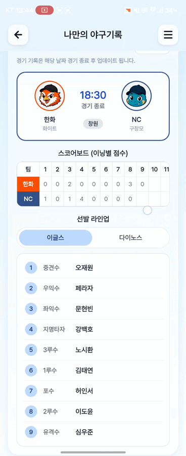 |
| 야구짝꿍 | 성별 · 닉네임 설정 | 야구짝꿍 메인화면 | 꾸미기 |
|  | 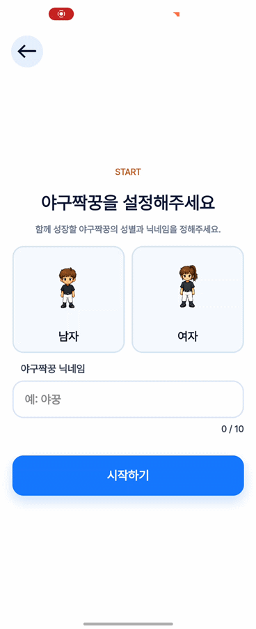 | 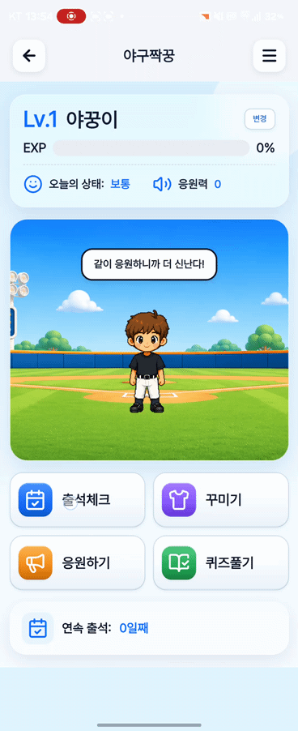 | 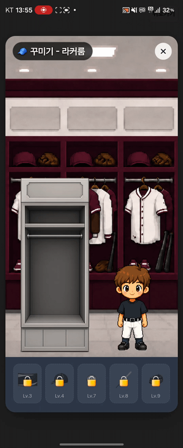 |
| 구장정보 | 구장 안내 | 먹거리 정보 | 지역 정보 |
|  | 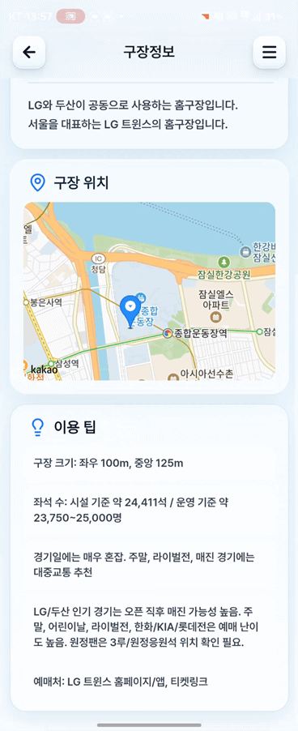 | 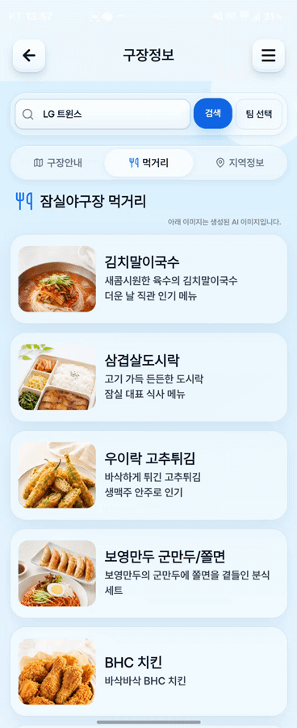 | 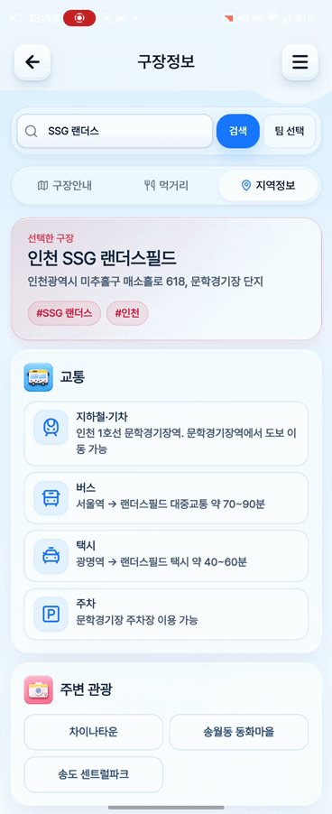 |
| 환경설정 | 환경설정 | 내 정보 | 응원구단 변경 |
|  | 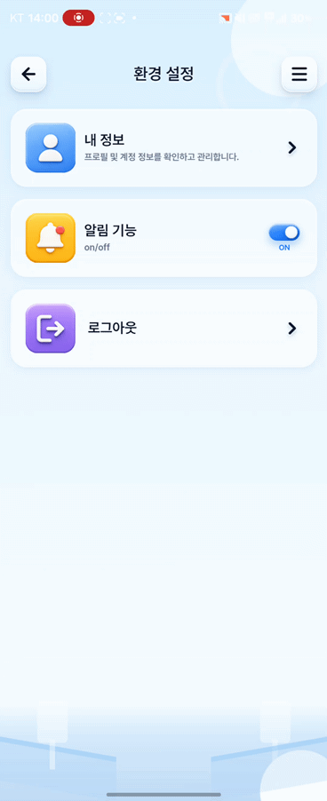 | 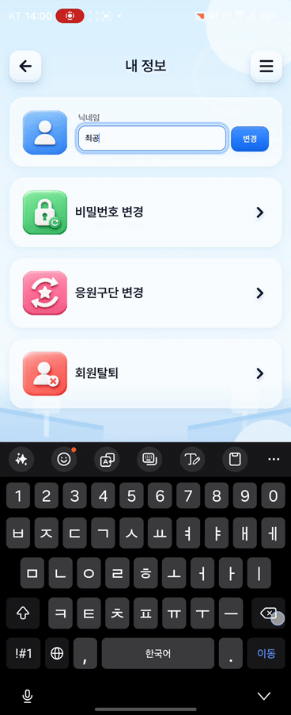 | 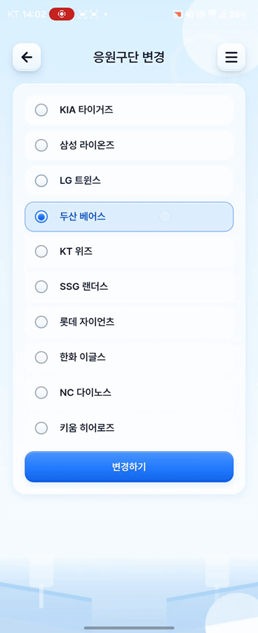 |

---

# 🛠️ Tech Stack

| Category | Stack |
|---|---|
| 🎨 Frontend | React 19, TypeScript, Vite 6, Capacitor 8 — 웹·안드(`frontend`) / iOS(`frontend-ios`) 분리 |
| 🧊 3D · 캐릭터 | three.js (3D 챗봇 캐릭터), Live2D Cubism (팀 선택 Live 2D), sql.js (로컬 SQLite) |
| ⚙️ Backend | FastAPI, Python, Cloud Run (asia-northeast3) |
| 🤖 AI · 음성 | Gemini 3.1 Flash-Lite (Vertex AI), ElevenLabs (구단 보이스 + 글자 타임스탬프), Azure Speech (TTS · viseme) |
| 🗄️ Database | PostgreSQL + pgvector (Supabase), MongoDB Atlas, sql.js (클라이언트) |
| 🗺️ Maps · Push | 카카오맵 (구장정보), FCM / APNs (푸시 알림) |
| 🔐 Authentication | JWT, Google · Kakao · Naver OAuth |
| ☁️ Deploy · CI | Firebase Hosting (FE), Cloud Run (BE), GitHub Actions, Cloud Scheduler (크롤) |
| 📝 Version Control | Git, GitHub |

---

# 🚀 통합 실행 방법

> 로컬에서 백엔드 · 프론트 · (선택) 크롤러를 함께 띄우는 순서입니다. 각 모듈 상세는 하단 문서 링크 참고.

### 사전 준비

- **Python 3.11+**, **Node.js 20+**
- 환경변수 파일 **2개** (둘 다 git 제외 — 값은 팀 비공개 채널로 공유)

  **루트 `.env`** (백엔드 · 크롤러 공용)
  ```
  MONGO_URI=...            # MongoDB Atlas (동적 기록)
  MONGO_DB=kbo
  DATABASE_URL=...         # PostgreSQL (Supabase)
  JWT_SECRET=...           # 로그인 토큰 서명
  ELEVENLABS_KEY=...       # 구단 보이스 TTS
  AZURE_SPEECH_KEY=...     # TTS · viseme (폴백)
  AZURE_SPEECH_REGION=...
  KMA_API_KEY=...          # 구장 날씨(기상청)
  # Gemini/Vertex는 GCP 서비스계정(ADC) 또는 키로 인증
  ```

  **`frontend/.env`** (프론트 빌드 변수)
  ```
  VITE_KAKAO_MAP_KEY=...    # 카카오맵(구장정보)
  VITE_GOOGLE_CLIENT_ID=... # 구글 로그인
  ```

### 1️⃣ 백엔드 — FastAPI (포트 8000)
```bash
pip install -r services/api/requirements.txt
python services/api/setup_db.py        # PostgreSQL 테이블 1회 생성
uvicorn main:app --app-dir services/api --port 8000
```
→ http://127.0.0.1:8000/docs (Swagger에서 바로 테스트)

### 2️⃣ 프론트엔드 — React + Vite (포트 5000)
```bash
cd frontend
npm install
npm run dev
```
→ http://127.0.0.1:5000 (백엔드로 프록시)

### 3️⃣ (선택) 데이터 크롤러 — KBO 일일 수집
```bash
pip install -r services/crawler/requirements.txt
python services/crawler/kbo_crawler.py     # 크롤 → data/crawling/<기준일>/*.json
python services/crawler/ingest_mongo.py    # → MongoDB 적재(upsert)
python services/crawler/crawl_profiles.py  # 선수 프로필(신규만)
```
> 운영 환경은 **Cloud Scheduler가 매일 09:00 자동 수집**. 정적 정보(teams · glossary · persona 등)는 DB 적재 전엔 빈 응답입니다.

### 📱 앱(iOS · Android) 빌드
Capacitor 기반. 빌드 · 실행 상세는 [`frontend/README.md`](frontend/README.md) 참고.

| 모듈 | 상세 문서 |
|---|---|
| 백엔드 API | [`services/api/README.md`](services/api/README.md) |
| 프론트엔드 | [`frontend/README.md`](frontend/README.md) |
| 데이터 크롤러 | [`services/crawler/README.md`](services/crawler/README.md) |
| 캐릭터 모델 | [`model/README.md`](model/README.md) |

---

# 🏗️ Architecture

```text
┌────────────────────────────────────────────────────────────────────┐
│ 클라이언트  ·  React 19 + Vite + Capacitor                          │
├────────────────────────────────────────────────────────────────────┤
│ · 웹·안드: frontend      · iOS: frontend-ios (폴더 분리)            │
│ · 챗 · 음성재생 · 3D 챗봇(three.js) · 팀 선택 Live2D                │
│ · 구장정보(카카오맵) · 로컬 SQLite(sql.js · IndexedDB)              │
└────────────────────────────────────────────────────────────────────┘
                                   │
                                   ▼   Firebase Hosting (정적 + rewrite)
                                   │
                                   ▼
┌────────────────────────────────────────────────────────────────────┐
│ Cloud Run · FastAPI  —  kbo-api (asia-northeast3)                  │
├────────────────────────────────────────────────────────────────────┤
│ · RAG 검색 + 임베딩 · 페르소나 · 완료율 계측                         │
│ · /chat  /tts  /auth  /quiz  /board  /attendance  /weather …       │
│ · dev push 시 자동 배포                                             │
└────────────────────────────────────────────────────────────────────┘
                                   │
                                   ▼   (백엔드 의존성)
┌────────────────────────────────────────────────────────────────────┐
│ 서버 저장소                                                         │
├────────────────────────────────────────────────────────────────────┤
│ · Supabase PostgreSQL + pgvector                                   │
│ · MongoDB (KBO 기록)                                               │
└────────────────────────────────────────────────────────────────────┘

┌────────────────────────────────────────────────────────────────────┐
│ 외부 AI · 음성                                                      │
├────────────────────────────────────────────────────────────────────┤
│ · Gemini 3.1 Flash-Lite (Vertex AI)  ·  ElevenLabs (구단 보이스)    │
│ · Azure Speech — TTS · viseme (폴백)                               │
└────────────────────────────────────────────────────────────────────┘

┌────────────────────────────────────────────────────────────────────┐
│ 외부 연동                                                           │
├────────────────────────────────────────────────────────────────────┤
│ · OAuth : Google · Kakao · Naver  ·  카카오맵 (구장정보)            │
│ · 기상청 날씨  ·  FCM / APNs 푸시                                   │
└────────────────────────────────────────────────────────────────────┘


┌────────────────────────────────────────────────────────────────────┐
│ 크롤 파이프라인                                                     │
├────────────────────────────────────────────────────────────────────┤
│ · Cloud Scheduler (매일 09:00)  →  크롤러  →  MongoDB               │
│ · KBO 게임센터 : 순위·선수기록·일정·라인업·박스스코어                 │
└────────────────────────────────────────────────────────────────────┘
```

---

# 📂 Project Structure

```text
📦 project
├─ 📂 frontend                # 웹 · 안드 — React 19 + Vite + Capacitor
│  ├─ 📂 public               #   3D 모델(.glb) · Live2D(/live2d/ball.model3.json)
│  ├─ 📂 android              #   Capacitor 안드 프로젝트
│  └─ 📂 src
│     ├─ 📂 components        #   MainViewV2 · Character3D · LatudiCharacter · Stadium* …
│     ├─ 📂 data · hooks · types
│     ├─ 📜 App.tsx · main.tsx · api.ts · appSettings.ts
│     ├─ 📜 db.ts(로컬 SQLite·sql.js) · lipSync.ts · push.ts
│     └─ 📜 theme.css
├─ 📂 frontend-ios            # iOS 전용 프론트 (폴더 분리)
├─ 📂 services
│  ├─ 📂 api                  # FastAPI 백엔드 (Cloud Run)
│  │   · main · auth · chat · tts · quiz · board · attendance · my_records
│  │   · visits · tamagotchi · push · weather · info · internal
│  │   · llm · embeddings · embed_chunks · pcache · personalization · session_metrics · fcm
│  │   · db.py / db_pg.py · schema.sql · board/push_schema.sql · setup_db.py
│  └─ 📂 crawler              # KBO 데일리 크롤러
│      · kbo_crawler · ingest_mongo · crawl_profiles · crawl_schedule · crawl_lineup · notify_games
├─ 📂 data
│  ├─ 📂 crawling             #   일별 크롤 덤프 (원본=MongoDB · git 제외)
│  └─ 📂 knowledge-base       #   KBO 문화·응원 청크 적재 SQL
├─ 📂 scripts                 # 운영 유틸 SQL/py (구장정보 · 다마고치 등)
├─ 📂 model                   # 캐릭터 3D 모델 안내
├─ 📂 docs                    # 평가 리포트 · 아키텍처 · 페르소나 카드 · 가이드
├─ 📂 .github/workflows       # CI/CD — deploy · ios-build · ios-testflight
├─ 📂 apps · infra · integrations   # 초기 모노레포 스캐폴드 (placeholder)
├─ 📜 requirements.txt · Procfile · package-lock.json
├─ 📜 README.md
└─ 📜 .env                    # git 제외 (값은 팀 채널 공유)
```